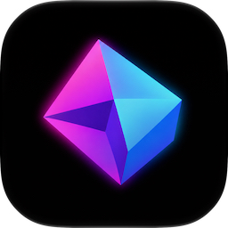

<!-- LOGO -->
<h1>
<p align="center">
 
 <br>Niftty
</h1>
 <p align="center">
 <strong>A terminal built for remote work</strong> <br />
 SSH, port forwarding, and drag-and-drop file upload —<br />
 in the Ghostty interface you love.<br />
 </p>
</p>

## About

Niftty is a fast, native, feature-rich terminal emulator focused on
working with remote machines, so you can spend less time
fiddling with tooling and more time getting work done.

## Features

| Feature | What it does |
| --------------------------- | ---------------------------------------------------------------------------------------------------------- |
| **SSH** | First-class SSH connectivity for connecting to remote hosts without ever leaving the terminal. |
| **Port forwarding** | Easily set up local and remote port forwarding so services on a remote machine behave like they're local. |
| **Drag-and-drop upload** | Drag files from your desktop straight into the terminal to upload them to the remote host. |
| **Smart clipboard** | Copy/paste with copy-on-select, paste protection against unsafe commands, and confirmation prompts whenever remote apps read or write your clipboard (OSC 52 / Kitty protocol). |
| **Built-in shaders** | Choose from bundled cursor effects with live previews in Settings, or point at your own glsl. |
| **Built-in text editor** | Open files in an editor pane right beside your terminal, with save and dirty-state tracking. |

## Building

To build the macOS app:

```shell-session
zig build
```

The canonical output is `zig-out/Niftty.app`. If you're on macOS and don't
need the app bundle, use `-Demit-macos-app=false` to speed up compilation.

---

<p align="center">Made with Zig</p>
